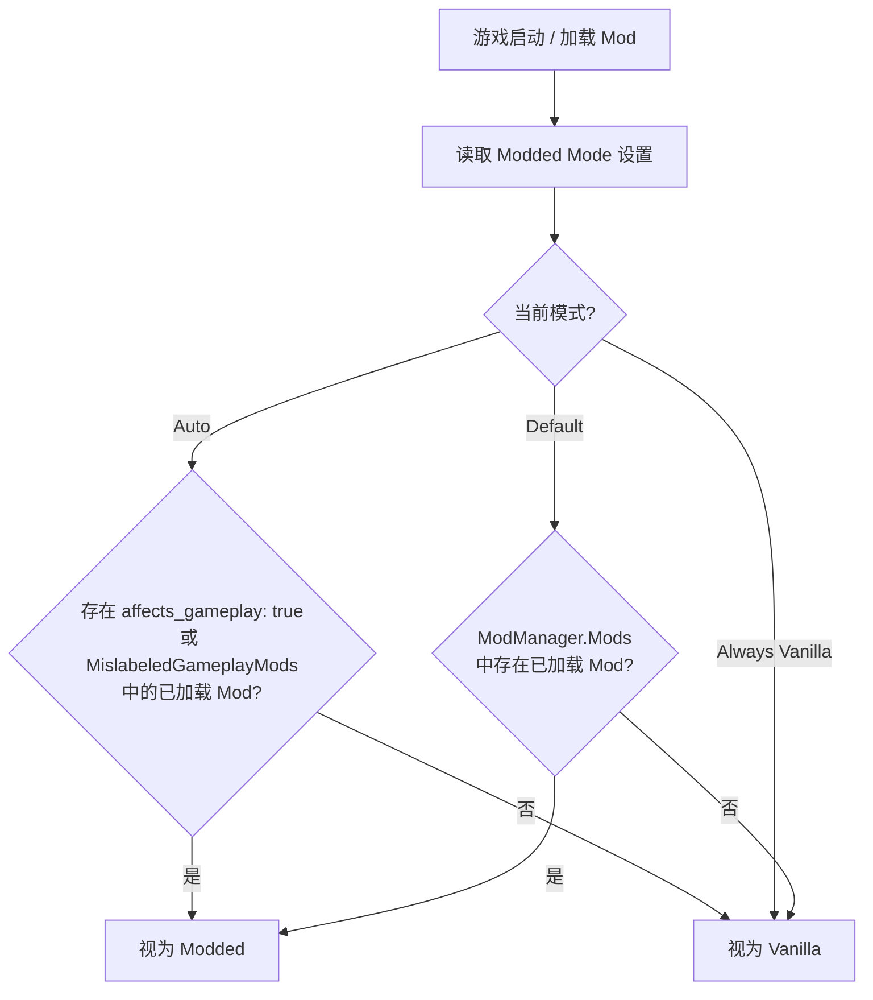
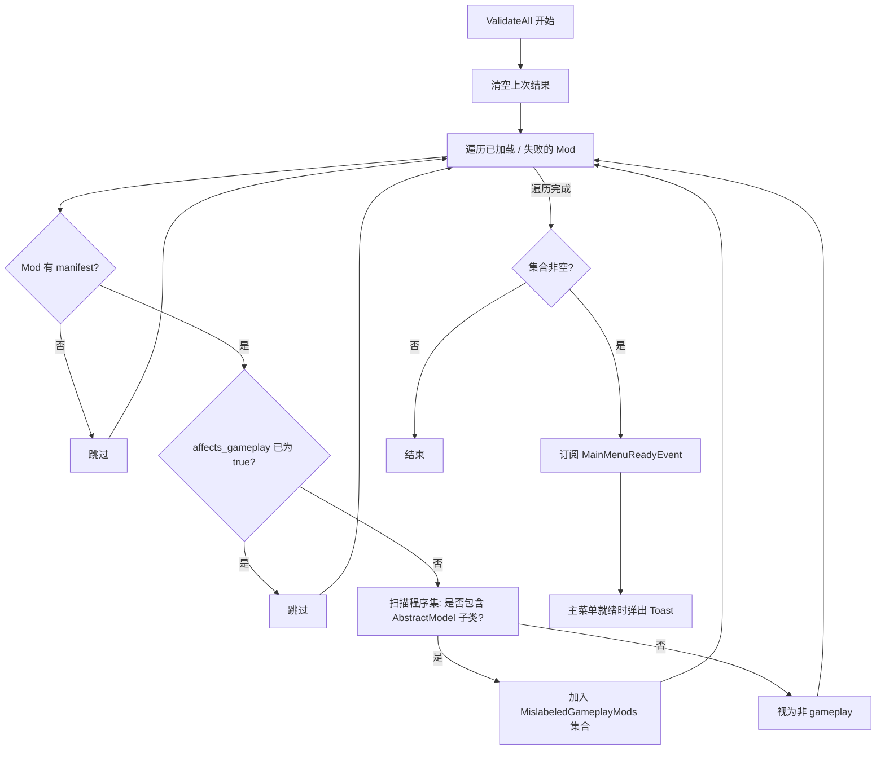

# Respect Affects Gameplay

[](LICENSE)
[](https://dotnet.microsoft.com/)
[](https://github.com/xiting910/RespectAffectsGameplay/actions/workflows/ci.yml)
[](https://github.com/xiting910/RespectAffectsGameplay/actions/workflows/codeql-analysis.yml)
[](https://github.com/xiting910/RespectAffectsGameplay/actions/workflows/dependency-review.yml)

**Respect Affects Gameplay** 是一个 [Slay the Spire 2](https://store.steampowered.com/app/2868840/Slay_the_Spire_II/)（STS2）的 Mod，它让游戏真正尊重每个 Mod 的 `affects_gameplay` 元数据标记。

---

## 目录

- [Respect Affects Gameplay](#respect-affects-gameplay)
  - [目录](#目录)
  - [安装](#安装)
    - [通过 Steam 创意工坊安装（推荐）](#通过-steam-创意工坊安装推荐)
    - [手动安装](#手动安装)
  - [项目结构](#项目结构)
  - [解决的问题](#解决的问题)
    - [问题一：存档路径被强行分离](#问题一存档路径被强行分离)
    - [问题二：联机哈希被非 gameplay Mod 污染](#问题二联机哈希被非-gameplay-mod-污染)
  - [工作原理](#工作原理)
    - [Harmony 补丁](#harmony-补丁)
    - [Mod 标记验证与 Toast 警告](#mod-标记验证与-toast-警告)
  - [模式说明](#模式说明)
  - [构建](#构建)
    - [环境要求](#环境要求)
    - [构建步骤](#构建步骤)
  - [本地化](#本地化)
    - [翻译文件格式](#翻译文件格式)
    - [添加新语言翻译](#添加新语言翻译)
    - [翻译文件加载优先级](#翻译文件加载优先级)
  - [许可证](#许可证)
  - [致谢](#致谢)

---

## 安装

本 Mod 已上架 **Steam 创意工坊**，推荐通过工坊订阅安装，自动获取更新。

### 通过 Steam 创意工坊安装（推荐）

1. 在 Steam 中打开 Slay the Spire 2 的 **创意工坊**。

2. 搜索 **"Respect Affects Gameplay"** 即可找到本 Mod。

3. 点击绿色的 **「订阅」** 按钮。

4. 开始游戏即可生效。

### 手动安装

如果你需要手动安装最新开发版，请参考下方 [构建](#构建) 章节自行编译，然后将 `workshop/content/` 下的文件放入游戏的 Mods 目录。

---

## 项目结构

```
RespectAffectsGameplay/
├── .github/
│   ├── workflows/                        # GitHub Actions 工作流
│   │   ├── ci.yml                        #   → push/PR 自动编译验证
│   │   ├── release.yml                   #   → 推送 v* 标签自动构建、发布 Release + Steam 创意工坊
│   │   ├── codeql-analysis.yml           #   → CodeQL 代码安全分析（C#）
│   │   ├── dependency-submission.yml     #   → 提交依赖快照供 Dependency Review 使用
│   │   ├── dependency-review.yml         #   → PR 中依赖变更时扫描已知漏洞
│   │   └── dependabot-auto-merge.yml     #   → Dependabot PR CI 通过后自动审批并 squash 合并
│   ├── ISSUE_TEMPLATE/                   # Issue 模板
│   │   ├── config.yml                    #   → 模板配置（启用空白 Issue、联系链接）
│   │   ├── bug_report.md                 #   → Bug 报告模板
│   │   └── feature_request.md            #   → 功能建议模板
│   ├── PULL_REQUEST_TEMPLATE.md          # PR 模板
│   └── dependabot.yml                    # Dependabot 自动依赖更新配置（NuGet + GitHub Actions）
├── stubs/                                # 桩项目（仅 CI 使用，本地开发不需要）
│   ├── sts2/
│   │   ├── sts2.csproj                   # 模拟 STS2 游戏程序集
│   │   └── Stubs.cs                      # 桩类型: ModManager, UserDataPathProvider 等
│   └── 0Harmony/
│       ├── 0Harmony.csproj               # 模拟 HarmonyLib 程序集
│       └── Stubs.cs                      # 桩类型: Harmony, HarmonyPatch 等
├── Scripts/
│   ├── RespectAffectsGameplay.csproj     # 主项目文件 (.NET 9.0)
│   ├── RespectAffectsGameplay.json       # Mod 元数据清单
│   ├── RespectAffectsGameplayMod.cs      # Mod 入口: 初始化 / 补丁 / IsEffectivelyModded()
│   ├── ModdedMode.cs                     # Modded 模式枚举 (Auto / AlwaysVanilla / Default)
│   ├── ModInfo.cs                        # Mod 元数据信息 (ID / 名称 / 版本 / 作者 / HarmonyId)
│   ├── ModLoc.cs                         # 本地化系统 (基于 RitsuLib I18N 框架，翻译文件作为嵌入资源分发)
│   ├── ModLog.cs                         # 统一日志系统 (自动前缀 + 详细日志开关)
│   ├── ModSettingsData.cs                # 持久化设置数据模型
│   ├── ModSettingsHelper.cs              # 设置初始化 / 持久化 / 重置为默认值
│   ├── LinuxNativeHelper.cs              # Linux libgcc_s 原生库加载辅助
│   ├── PatchGetIsRunningModded.cs        # 拦截 UserDataPathProvider.IsRunningModded getter
│   ├── PatchSetIsRunningModded.cs        # 拦截 UserDataPathProvider.IsRunningModded setter
│   ├── PatchGetProfileDir.cs             # 拦截存档目录生成方法
│   ├── PatchModelIdSerializationCache.cs # 拦截联机哈希计算，排除非 gameplay Mod
│   ├── PatchModManagerIsRunningModded.cs # 可选拦截 ModManager.IsRunningModded()
│   ├── ModAffectsGameplayValidator.cs    # Mod affects_gameplay 标记验证 + Toast 警告
│   ├── localization/                     # 本地化语言文件
│   │   ├── eng.json                      #   英语
│   │   └── zhs.json                      #   简体中文
│   └── Directory.Build.props             # 开发环境路径配置 (gitignore, CI 不需要)
├── workshop/                             # Steam 创意工坊上传工作区
│   ├── workshop.json                     #   工坊元数据（标题、描述、可见性、标签）
│   ├── mod_id.txt                        #   工坊物品 ID
│   └── image.png                         #   工坊封面图
├── RespectAffectsGameplay.slnx           # 解决方案文件
├── .editorconfig                         # 代码风格配置
├── .gitignore                            # Git 忽略规则
├── LICENSE                               # MIT 许可证
├── CHANGELOG.md                          # 变更日志
└── README.md                             # 本文档
```

---

## 解决的问题

默认情况下，STS2 只要检测到**任意** Mod 被加载，就会将整个游戏标记为 "modded（已修改）" 状态。具体表现为两个独立问题：

### 问题一：存档路径被强行分离

`UserDataPathProvider.GetProfileDir()` 根据 `IsRunningModded` 属性决定存档目录是否带有 `modded/` 前缀。任何 Mod（包括外观、基础库、辅助类等 `affects_gameplay: false` 的 Mod）加载后，`IsRunningModded` 被设为 `true`，存档即被隔离到 `modded/profileX/`。卸载这些 Mod 后存档看似"丢失"，因为它还在 `modded/` 子目录中。

### 问题二：联机哈希被非 gameplay Mod 污染

`ModelIdSerializationCache.Init()` 在计算联机 XXH32 哈希时，遍历 `ModManager.Mods` 中**所有**已加载 Mod 的 `AbstractModel` 子类型，不区分 `affects_gameplay`。

**RespectAffectsGameplay** 同时解决这两个问题：通过 Harmony 补丁让存档路径只对 gameplay Mod 敏感，同时从联机哈希计算中排除非 gameplay Mod。

---

## 工作原理



### Harmony 补丁

本 Mod 使用 5 个 Harmony 补丁，其中 4 个始终启用，1 个由用户可选开关控制：

| 补丁                             | 目标方法                                      | 默认   | 作用                                                                                                           |
| -------------------------------- | --------------------------------------------- | ------ | -------------------------------------------------------------------------------------------------------------- |
| `PatchGetIsRunningModded`        | `UserDataPathProvider.IsRunningModded` getter | ✅ 始终 | 读取属性时返回 `IsEffectivelyModded()` 的修正值                                                                |
| `PatchSetIsRunningModded`        | `UserDataPathProvider.IsRunningModded` setter | ✅ 始终 | 写入属性时替换为 `IsEffectivelyModded()` 的值                                                                  |
| `PatchGetProfileDir`             | `UserDataPathProvider.GetProfileDir`          | ✅ 始终 | 无 gameplay Mod 时返回 vanilla 路径 `profileX`                                                                 |
| `PatchModelIdSerializationCache` | `ModelIdSerializationCache.Init`              | ⚡ 自动 | 临时过滤 `ModManager.Mods`，使哈希仅由 gameplay Mod 决定；若检测到 RitsuLib 已安装同名补丁则自动禁用，避免冲突 |
| `PatchModManagerIsRunningModded` | `ModManager.IsRunningModded`                  | ⚙ 可选 | 开启后连 UI、Sentry、联机列表也受 Modded Mode 控制                                                             |

> **设计决策**:
> - 存档路径由前 3 个补丁分层控制（属性 getter → setter → 最终路径生成），即使外部代码通过其他方式修改 `IsRunningModded` 也能兜底。
> - 联机哈希由 `PatchModelIdSerializationCache` 通过 Prefix+Postfix+Finalizer 临时标志位方案精准过滤，
>   仅在 `Init()` 执行期间让 `ModManager.Mods` 返回排除非 gameplay Mod 的列表，不永久影响其他调用方。
> - 初始化步骤 5 会检测 RitsuLib 版本中是否包含 `ModelIdSerializationCacheDynamicContentPatch`，
>   若存在则自动 Unpatch 本 Mod 的 `PatchModelIdSerializationCache`，避免两个补丁对同一方法进行修改导致意外行为。
> - `PatchModManagerIsRunningModded` 默认关闭。该方法被 UI（主界面 / 游戏内 mod 数量）、
>   Sentry 错误上报、联机 Mod 列表等多处调用，统一替换会隐藏 UI 信息。用户可在设置中手动开启。

### Mod 标记验证与 Toast 警告

`ModAffectsGameplayValidator` 在 Mod 初始化阶段（第 7 步）自动执行，验证所有已加载 Mod 的 `affects_gameplay` 标记是否准确：



**验证逻辑**: 通过 `ReflectionHelper.GetSubtypesFromAssembly()` 扫描每个 `affects_gameplay: false` 的 Mod 程序集，若发现任何 `AbstractModel` 子类型，说明该 Mod 实际包含游戏内容数据，应被标记为 `affects_gameplay: true`。

**Toast 提醒**: 主菜单就绪后通过 `RitsuToastService` 弹出 5 秒 `Warning` 级别通知，列出所有标记不准确的 Mod ID，提醒玩家联系 Mod 作者修复并建议暂时禁用。

**Auto 模式自动修正**: 验证结果不止用于报警。`EvaluateAutoMode()` 在分类 Mod 时会将 `MislabeledGameplayMods` 中的 Mod **强制视为 gameplay Mod**，等同于修正了 `affects_gameplay` 标记。这意味着即使 Mod 作者未正确设置元数据，本 Mod 也能在运行时主动保护存档路径和联机哈希不受误标 Mod 影响而导致出错。

> ⚠ 若 RitsuLib 版本不支持 Toast API，会静默跳过，不影响 Mod 核心功能及 Auto 模式修正逻辑。

---

## 模式说明

本 Mod 依赖 [STS2-RitsuLib](https://github.com/BAKAOLC/STS2-RitsuLib) 框架，通过 `RitsuModManager.GetKnownMods()` 获取已加载 Mod 列表并逐个检查其 `affects_gameplay` 标记。

在游戏内的 Mod 设置页面中，你可以选择三种运行模式，以及一个可选高级开关：

| 设置项                     | 选项                         | 行为                                                                                                   |
| -------------------------- | ---------------------------- | ------------------------------------------------------------------------------------------------------ |
| **Modded Mode**            | `Auto`（自动）⭐              | 仅当存在 `affects_gameplay: true` 或被验证器检测到误标（`MislabeledGameplayMods`）的 Mod 时视为 modded |
|                            | `Always Vanilla`（强制原版） | 永不视为 modded（⚠ 可能导致存档损坏）                                                                  |
|                            | `Default`（游戏默认）        | 使用游戏原版逻辑（ModManager.Mods），加载任意 Mod 即视为 modded                                        |
| **拦截 IsRunningModded()** | 关闭（默认）                 | 仅存档路径受控，UI / 联机列表不受影响                                                                  |
|                            | 开启                         | `ModManager.IsRunningModded()` 也受 Modded Mode 控制                                                   |
| **详细日志**               | 关闭（默认）                 | 仅输出 Info / Warn / Error 日志                                                                        |
|                            | 开启                         | 额外输出 Debug 日志 (仅影响本 mod, 即时生效)                                                           |
| **重置为默认设置**         | 点击「恢复默认」按钮         | 所有设置恢复默认值（Modded Mode → 自动，其余开关 → 关闭）                                              |

> ⚠ 除「详细日志」外, 其余设置项修改后需**重启游戏**才能生效。点击按钮后设置立即持久化到 `settings.json`。

---

## 构建

### 环境要求

- [.NET 9.0 SDK](https://dotnet.microsoft.com/download/dotnet/9.0)
- STS2 游戏本体（用于引用程序集）
- 项目自动检测目标平台（Windows / macOS / Linux / Android），无需手动配置平台参数

### 构建步骤

1. 克隆仓库：
   ```bash
   git clone https://github.com/xiting910/RespectAffectsGameplay.git
   ```

2. 在 `Scripts/` 目录下创建 `Directory.Build.props`（**本地开发必需**，CI 不需要）：
   ```xml
   <Project>
     <PropertyGroup>
       <Sts2Dir>你的 STS2 游戏安装路径</Sts2Dir>
     </PropertyGroup>
   </Project>
   ```
   > 该文件已在 `.gitignore` 中排除，不会提交到仓库。若未创建此文件，项目将回退使用 `stubs/` 下的桩程序集编译。

3. 构建项目：
   ```bash
   dotnet build
   ```

   构建完成后，产物会自动复制到：**`workshop/content/`** — 供 Steam 创意工坊上传

> **CI 说明：** `ci.yml` 在每次 push/PR 时自动编译验证。`release.yml` 在推送 `v*` 标签时自动发布 GitHub Release 并更新 Steam 创意工坊。

> ⚠ **重要：`stubs/` 必须与项目引用和游戏实际 API 保持同步！**
>
> CI 环境没有 STS2 游戏本体，完全依赖 `stubs/` 目录下的桩程序集进行编译。
> 如果你在代码中使用了新的游戏 API（新的类、方法、属性等），**必须同步更新 `stubs/` 中对应的桩代码**，
> 否则 CI 编译会失败，PR 无法合并。
>
> - `stubs/sts2/Stubs.cs` — 模拟 STS2 游戏程序集中的类型（`ModManager`、`UserDataPathProvider`、`AbstractModel` 等）
> - `stubs/0Harmony/Stubs.cs` — 模拟 HarmonyLib 中的类型（`Harmony`、`HarmonyPatch`、`HarmonyPrefix` 等）
>
> 桩方法体可以留空（`throw new NotImplementedException()`），但**方法签名必须与实际游戏库一致**。

---

## 本地化

本 Mod 的界面文本通过 [STS2-RitsuLib](https://github.com/BAKAOLC/STS2-RitsuLib) 的 I18N 框架实现多语言支持。翻译文件以 JSON 格式存放于 `Scripts/localization/` 目录，作为嵌入资源（`EmbeddedResource`）编译到程序集中。

### 翻译文件格式

```json
{
    "settings.section.general": "通用",
    "settings.mode.label": "Modded 模式",
    "settings.mode.option.auto": "自动",
    ...
}
```

键名与代码中的 `ModSettingsText.I18N` 调用一一对应。

### 添加新语言翻译

**方式一：从源码构建（开发者推荐）**

1. 在 `Scripts/localization/` 下创建新的 JSON 文件，命名为 `{语言代码}.json`（例如 `jpn.json`、`kor.json`）
   > 语言代码参考 STS2 规范：`eng`（英语）、`zhs`（简体中文）、`zht`（繁体中文）、`jpn`（日语）、`kor`（韩语）等
2. 复制 `eng.json` 的全部键，将值翻译为目标语言
3. 构建项目，新文件会被 `.csproj` 的通配符 `<EmbeddedResource Include="localization\*.*" />` 自动收录为嵌入资源

**方式二：运行时添加（最终用户方式）**

1. 找到本 Mod 的用户数据目录：`Godot.OS.GetUserDataDir()/RespectAffectsGameplay/localization/`
   - Windows 位于 `%AppData%/Roaming/SlayTheSpire2/RespectAffectsGameplay/localization/`
2. 将 `{语言代码}.json` 文件放入该目录
3. 重启游戏即可生效

### 翻译文件加载优先级

```
用户数据目录下的文件（最高优先级）
         ↓
内置嵌入资源（回退，随 Mod 分发）
```

> 首次运行时，`ModLoc.Initialize()` 会自动将内置的翻译文件从嵌入资源导出到用户数据目录。
> 用户可在此目录中直接修改或替换翻译，无需重新编译 Mod。

---

## 许可证

本项目基于 [MIT License](LICENSE) 开源。

---

## 致谢

- 本项目灵感来源于 [luojiesi/SLS2Mods](https://github.com/luojiesi/SLS2Mods/tree/master/UnifiedSavePath) 中的 UnifiedSavePath Mod，它使用 Harmony 补丁拦截 `IsRunningModded` 来统一存档路径。本项目在此基础上扩展了 `affects_gameplay` 标记识别、多模式切换、游戏内设置页面等功能。
- [BAKAOLC/STS2-RitsuLib](https://github.com/BAKAOLC/STS2-RitsuLib) — STS2 Mod 核心框架
- [Harmony](https://github.com/pardeike/Harmony) — .NET 运行时方法补丁库
- [Slay the Spire 2](https://store.steampowered.com/app/2868840/Slay_the_Spire_II/) — Mega Crit Games
