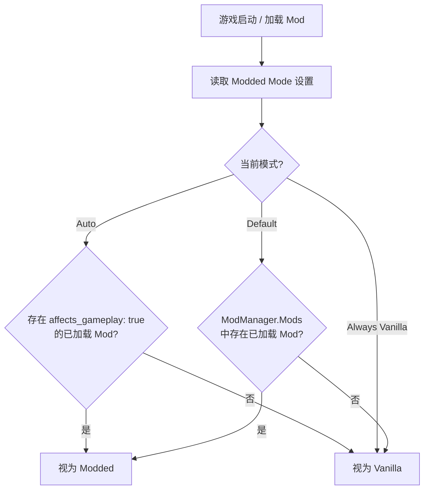

# Respect Affects Gameplay

[](LICENSE)
[](https://dotnet.microsoft.com/)
[](https://github.com/xiting910/RespectAffectsGameplay/actions/workflows/ci.yml)
[](https://store.steampowered.com/app/2868840/Slay_the_Spire_II/)

**Respect Affects Gameplay** 是一个 [Slay the Spire 2](https://store.steampowered.com/app/2868840/Slay_the_Spire_II/)（STS2）的 Mod，它让游戏真正尊重每个 Mod 的 `affects_gameplay` 元数据标记。

---

## 目录

- [Respect Affects Gameplay](#respect-affects-gameplay)
  - [目录](#目录)
  - [项目结构](#项目结构)
  - [解决的问题](#解决的问题)
    - [问题一：存档路径被强行分离](#问题一存档路径被强行分离)
    - [问题二：联机哈希被非 gameplay Mod 污染](#问题二联机哈希被非-gameplay-mod-污染)
  - [工作原理](#工作原理)
    - [Harmony 补丁](#harmony-补丁)
  - [模式说明](#模式说明)
  - [构建](#构建)
    - [环境要求](#环境要求)
    - [构建步骤](#构建步骤)
  - [许可证](#许可证)
  - [致谢](#致谢)

---

## 项目结构

```
RespectAffectsGameplay/
├── .github/
│   ├── workflows/                        # CI / CodeQL 工作流
│   ├── ISSUE_TEMPLATE/                   # Issue 模板
│   ├── PULL_REQUEST_TEMPLATE.md          # PR 模板
│   └── dependabot.yml                    # 依赖自动更新配置
├── stubs/                                # 桩项目（仅 CI 使用，本地开发不需要）
│   ├── sts2/
│   │   ├── sts2.csproj                   # 模拟 STS2 游戏程序集
│   │   └── Stubs.cs                      # 桩类型: ModManager, UserDataPathProvider 等
│   └── 0Harmony/
│       ├── 0Harmony.csproj               # 模拟 HarmonyLib 程序集
│       └── Stubs.cs                      # 桩类型: Harmony, HarmonyPatch 等
├── Scripts/
│   ├── RespectAffectsGameplay.csproj     # 主项目文件 (.NET 9.0)
│   ├── RespectAffectsGameplay.json       # Mod 元数据清单
│   ├── RespectAffectsGameplayMod.cs      # Mod 入口: 初始化设置 / 补丁 / 核心判断 IsEffectivelyModded()
│   ├── ModdedMode.cs                     # Modded 模式枚举 (Auto / AlwaysVanilla / Default)
│   ├── ModInfo.cs                        # Mod 元数据信息 (ID / 名称 / 作者 / HarmonyId)
│   ├── ModSettingsData.cs                # 持久化设置数据模型
│   ├── ModSettingsHelper.cs              # 设置初始化 / 持久化 / 重置为默认值
│   ├── LinuxNativeHelper.cs              # Linux libgcc_s 原生库加载辅助
│   ├── PatchGetIsRunningModded.cs        # 拦截 UserDataPathProvider.IsRunningModded getter
│   ├── PatchSetIsRunningModded.cs        # 拦截 UserDataPathProvider.IsRunningModded setter
│   ├── PatchGetProfileDir.cs             # 拦截存档目录生成方法
│   ├── PatchModelIdSerializationCache.cs # 拦截联机哈希计算，排除非 gameplay Mod
│   └── PatchModManagerIsRunningModded.cs # 可选拦截 ModManager.IsRunningModded()
├── RespectAffectsGameplay.slnx           # 解决方案文件
├── LICENSE                               # MIT 许可证
├── CHANGELOG.md                          # 变更日志
└── README.md                             # 本文档
```

---

## 解决的问题

默认情况下，STS2 只要检测到**任意** Mod 被加载，就会将整个游戏标记为 "modded（已修改）" 状态。具体表现为两个独立问题：

### 问题一：存档路径被强行分离

`UserDataPathProvider.GetProfileDir()` 根据 `IsRunningModded` 属性决定存档目录是否带有 `modded/` 前缀。任何 Mod（包括外观、基础库、辅助类等 `affects_gameplay: false` 的 Mod）加载后，`IsRunningModded` 被设为 `true`，存档即被隔离到 `modded/profileX/`。卸载这些 Mod 后存档看似"丢失"，因为它还在 `modded/` 子目录中。

### 问题二：联机哈希被非 gameplay Mod 污染

`ModelIdSerializationCache.Init()` 在计算联机 XXH32 哈希时，遍历 `ModManager.Mods` 中**所有**已加载 Mod 的 `AbstractModel` 子类型，不区分 `affects_gameplay`。BASELIB/RitsuLib 等模组框架（通常标记 `affects_gameplay: false`）也会注册 `AbstractModel` 子类型，导致 Host 与 Vanilla Client 之间哈希不一致，触发 "版本不匹配" 错误。

**RespectAffectsGameplay** 同时解决这两个问题：通过 Harmony 补丁让存档路径只对 gameplay Mod 敏感，同时从联机哈希计算中排除非 gameplay Mod。

---

## 工作原理



### Harmony 补丁

本 Mod 使用 5 个 Harmony 补丁，其中 4 个始终启用，1 个由用户可选开关控制：

| 补丁                             | 目标方法                                      | 默认   | 作用                                                     |
| -------------------------------- | --------------------------------------------- | ------ | -------------------------------------------------------- |
| `PatchGetIsRunningModded`        | `UserDataPathProvider.IsRunningModded` getter | ✅ 始终 | 读取属性时返回 `IsEffectivelyModded()` 的修正值          |
| `PatchSetIsRunningModded`        | `UserDataPathProvider.IsRunningModded` setter | ✅ 始终 | 写入属性时替换为 `IsEffectivelyModded()` 的值            |
| `PatchGetProfileDir`             | `UserDataPathProvider.GetProfileDir`          | ✅ 始终 | 无 gameplay Mod 时返回 vanilla 路径 `profileX`           |
| `PatchModelIdSerializationCache` | `ModelIdSerializationCache.Init`              | ✅ 始终 | 临时过滤 `ModManager.Mods`，使哈希仅由 gameplay Mod 决定 |
| `PatchModManagerIsRunningModded` | `ModManager.IsRunningModded`                  | ⚙ 可选 | 开启后连 UI、Sentry、联机列表也受 Modded Mode 控制       |

> **设计决策**:
> - 存档路径由前 3 个补丁分层控制（属性 getter → setter → 最终路径生成），即使外部代码通过其他方式修改 `IsRunningModded` 也能兜底。
> - 联机哈希由 `PatchModelIdSerializationCache` 通过 Prefix+Postfix+Finalizer 临时标志位方案精准过滤，
>   仅在 `Init()` 执行期间让 `ModManager.Mods` 返回排除非 gameplay Mod 的列表，不永久影响其他调用方。
> - `PatchModManagerIsRunningModded` 默认关闭。该方法被 UI（主界面 / 游戏内 mod 数量）、
>   Sentry 错误上报、联机 Mod 列表等多处调用，统一替换会隐藏 UI 信息。用户可在设置中手动开启。

---

## 模式说明

本 Mod 依赖 [STS2-RitsuLib](https://github.com/BAKAOLC/STS2-RitsuLib) 框架，通过 `RitsuModManager.GetKnownMods()` 获取已加载 Mod 列表并逐个检查其 `affects_gameplay` 标记。

在游戏内的 Mod 设置页面中，你可以选择三种运行模式，以及一个可选高级开关：

| 设置项                     | 选项                         | 行为                                                            |
| -------------------------- | ---------------------------- | --------------------------------------------------------------- |
| **Modded Mode**            | `Auto`（自动）⭐              | 仅当存在 `affects_gameplay: true` 的 Mod 时视为 modded          |
|                            | `Always Vanilla`（强制原版） | 永不视为 modded（⚠ 可能导致存档损坏）                           |
|                            | `Default`（游戏默认）        | 使用游戏原版逻辑（ModManager.Mods），加载任意 Mod 即视为 modded |
| **拦截 IsRunningModded()** | 关闭（默认）                 | 仅存档路径受控，UI / 联机列表不受影响                           |
|                            | 开启                         | `ModManager.IsRunningModded()` 也受 Modded Mode 控制            |
| **重置为默认设置**         | 点击「恢复默认」按钮         | 所有设置恢复默认值（Modded Mode → 自动，拦截开关 → 关闭）       |

> ⚠ 所有设置项修改后需**重启游戏**才能生效。点击按钮后设置立即持久化到 `settings.json`。

---

## 构建

### 环境要求

- [.NET 9.0 SDK](https://dotnet.microsoft.com/download/dotnet/9.0)
- STS2 游戏本体（用于引用程序集）
- 项目自动检测目标平台（Windows / macOS / Linux / Android），无需手动配置平台参数

### 构建步骤

1. 克隆仓库：
   ```bash
   git clone https://github.com/xiting910/RespectAffectsGameplay.git
   ```

2. 在 `Scripts/` 目录下创建 `Directory.Build.props`（**本地开发必需**，CI 不需要）：
   ```xml
   <Project>
     <PropertyGroup>
       <Sts2Dir>你的 STS2 游戏安装路径</Sts2Dir>
     </PropertyGroup>
   </Project>
   ```
   > 该文件已在 `.gitignore` 中排除，不会提交到仓库。若无此文件，项目将使用根目录 `stubs/` 下的桩程序集进行编译。

3. 构建项目：
   ```bash
   dotnet build
   ```

> **CI 说明：** GitHub Actions 工作流会先编译 `stubs/` 下的桩项目，再将生成的 DLL 复制到 `stubs/data_sts2_linuxbsd_x86_64/`，最后编译主项目。本地开发无需关心此流程。

---

## 许可证

本项目基于 [MIT License](LICENSE) 开源。

---

## 致谢

- 本项目灵感来源于 [luojiesi/SLS2Mods](https://github.com/luojiesi/SLS2Mods/tree/master/UnifiedSavePath) 中的 UnifiedSavePath Mod，它使用 Harmony 补丁拦截 `IsRunningModded` 来统一存档路径。本项目在此基础上扩展了 `affects_gameplay` 标记识别、多模式切换、游戏内设置页面等功能。
- [BAKAOLC/STS2-RitsuLib](https://github.com/BAKAOLC/STS2-RitsuLib) — STS2 Mod 核心框架
- [Harmony](https://github.com/pardeike/Harmony) — .NET 运行时方法补丁库
- [Slay the Spire 2](https://store.steampowered.com/app/2868840/Slay_the_Spire_II/) — Mega Crit Games
