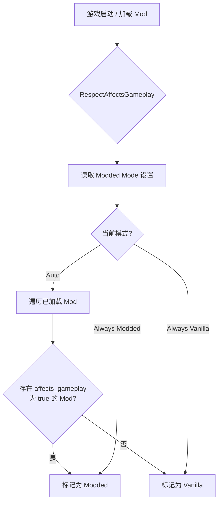

# Respect Affects Gameplay

[](LICENSE)
[](https://dotnet.microsoft.com/)
[](https://github.com/xiting910/RespectAffectsGameplay/actions/workflows/ci.yml)
[](https://store.steampowered.com/app/2868840/Slay_the_Spire_II/)

**Respect Affects Gameplay** 是一个 [Slay the Spire 2](https://store.steampowered.com/app/2868840/Slay_the_Spire_II/)（STS2）的 Mod，它让游戏真正尊重每个 Mod 的 `affects_gameplay` 元数据标记。

---

## 目录

- [Respect Affects Gameplay](#respect-affects-gameplay)
  - [目录](#目录)
  - [解决的问题](#解决的问题)
  - [工作原理](#工作原理)
    - [Harmony 补丁](#harmony-补丁)
  - [模式说明](#模式说明)
  - [构建](#构建)
    - [环境要求](#环境要求)
    - [构建步骤](#构建步骤)
  - [项目结构](#项目结构)
  - [许可证](#许可证)
  - [致谢](#致谢)

---

## 解决的问题

默认情况下，STS2 只要检测到**任意** Mod 被加载，就会将整个游戏标记为 "modded（已修改）" 状态，导致：

- 🗂️ **存档分离** — Modded 和 Vanilla（原版）存档被存放在不同的目录中
- 🚫 **无法联机** — 标记为 modded 后无法参与原版多人游戏

这意味着即使你只安装了纯外观类或界面优化的 Mod（这些 Mod 的 `affects_gameplay` 标记为 `false`），你的存档仍然会被隔离，多人游戏仍然会被阻止。

**RespectAffectsGameplay** 解决了这个问题：它通过 Harmony 补丁拦截游戏内部的 `IsRunningModded` 判断逻辑，改为根据**实际加载的 Mod 是否包含 `affects_gameplay: true`** 来决定游戏是否处于 modded 状态。

---

## 工作原理



### Harmony 补丁

本 Mod 通过 3 个 Harmony 补丁精确控制存档路径，而不影响 UI 显示：

| 补丁                      | 目标方法                                      | 类型   | 作用                                           |
| ------------------------- | --------------------------------------------- | ------ | ---------------------------------------------- |
| `PatchGetIsRunningModded` | `UserDataPathProvider.IsRunningModded` getter | Prefix | 读取时返回 `IsEffectivelyModded()` 的修正值    |
| `PatchSetIsRunningModded` | `UserDataPathProvider.IsRunningModded` setter | Prefix | 写入时替换为 `IsEffectivelyModded()` 的修正值  |
| `PatchGetProfileDir`      | `UserDataPathProvider.GetProfileDir`          | Prefix | 无 gamepaly mod 时返回 vanilla 路径 `profileX` |

---

## 模式说明

本 Mod 依赖 [STS2-RitsuLib](https://github.com/BAKAOLC/STS2-RitsuLib) 框架，通过 `RitsuModManager.GetKnownMods()` 获取已加载 Mod 列表并逐个检查其 `affects_gameplay` 标记。

在游戏内的 Mod 设置页面中，你可以选择三种运行模式：

| 模式                             | 行为                                                         | 推荐场景                           |
| -------------------------------- | ------------------------------------------------------------ | ---------------------------------- |
| **Auto**（自动）                 | 仅当加载了 `affects_gameplay: true` 的 Mod 时才标记为 modded | ⭐ 推荐，大部分情况下使用           |
| **Always Vanilla**（始终原版）   | 无论如何都不标记为 modded                                    | 测试用途（⚠️ 可能导致存档问题）     |
| **Always Modded**（始终 Modded） | 只要加载了任意 Mod 就标记为 modded                           | 需要独立存档时使用（恢复原版行为） |

---

## 构建

### 环境要求

- [.NET 9.0 SDK](https://dotnet.microsoft.com/download/dotnet/9.0)
- STS2 游戏本体（用于引用程序集）
- 项目自动检测目标平台（Windows / macOS / Linux / Android），无需手动配置平台参数

### 构建步骤

1. 克隆仓库：
   ```bash
   git clone https://github.com/xiting910/RespectAffectsGameplay.git
   ```

2. 在 `Scripts/` 目录下创建 `Directory.Build.props`（**本地开发必需**，CI 不需要）：
   ```xml
   <Project>
     <PropertyGroup>
       <Sts2Dir>你的 STS2 游戏安装路径</Sts2Dir>
     </PropertyGroup>
   </Project>
   ```
   > 该文件已在 `.gitignore` 中排除，不会提交到仓库。若无此文件，项目将使用根目录 `stubs/` 下的桩程序集进行编译。

3. 构建项目：
   ```bash
   dotnet build
   ```

> **CI 说明：** GitHub Actions 工作流会先编译 `stubs/` 下的桩项目，再将生成的 DLL 复制到 `stubs/data_sts2_linuxbsd_x86_64/`，最后编译主项目。本地开发无需关心此流程。

---

## 项目结构

```
RespectAffectsGameplay/
├── .github/
│   └── workflows/                      # CI / CodeQL 工作流
├── stubs/                              # 桩项目（仅 CI 使用，本地开发不需要）
│   ├── sts2/
│   │   ├── sts2.csproj                 # 模拟 STS2 游戏程序集
│   │   └── Stubs.cs                    # 桩类型: ModManager, UserDataPathProvider 等
│   └── 0Harmony/
│       ├── 0Harmony.csproj             # 模拟 HarmonyLib 程序集
│       └── Stubs.cs                    # 桩类型: Harmony, HarmonyPatch 等
├── Scripts/
│   ├── RespectAffectsGameplay.csproj   # 主项目文件 (.NET 9.0)
│   ├── RespectAffectsGameplay.json     # Mod 元数据清单
│   ├── RespectAffectsGameplayMod.cs    # Mod 入口: 初始化设置 / 补丁 / 核心判断 IsEffectivelyModded()
│   ├── ModdedMode.cs                   # Modded 模式枚举 (Auto / AlwaysVanilla / AlwaysModded)
│   ├── ModInfo.cs                      # Mod 元数据信息 (ID / 名称 / 作者 / HarmonyId)
│   ├── ModSettingsData.cs              # 持久化设置数据模型
│   ├── ModSettingsHelper.cs            # 设置初始化与 CRUD 辅助类
│   ├── LinuxNativeHelper.cs            # Linux libgcc_s 原生库加载辅助
│   ├── PatchGetIsRunningModded.cs      # 拦截 UserDataPathProvider.IsRunningModded getter
│   ├── PatchSetIsRunningModded.cs      # 拦截 UserDataPathProvider.IsRunningModded setter
│   └── PatchGetProfileDir.cs           # 拦截存档目录生成方法
├── RespectAffectsGameplay.slnx         # 解决方案文件
├── LICENSE                             # MIT 许可证
├── CHANGELOG.md                        # 变更日志
└── README.md
```

---

## 许可证

本项目基于 [MIT License](LICENSE) 开源。

---

## 致谢

- 本项目灵感来源于 [luojiesi/SLS2Mods](https://github.com/luojiesi/SLS2Mods/tree/master/UnifiedSavePath) 中的 UnifiedSavePath Mod，它使用 Harmony 补丁拦截 `IsRunningModded` 来统一存档路径。本项目在此基础上扩展了 `affects_gameplay` 标记识别、多模式切换、游戏内设置页面等功能。
- [BAKAOLC/STS2-RitsuLib](https://github.com/BAKAOLC/STS2-RitsuLib) — STS2 Mod 核心框架
- [Harmony](https://github.com/pardeike/Harmony) — .NET 运行时方法补丁库
- [Slay the Spire 2](https://store.steampowered.com/app/2868840/Slay_the_Spire_II/) — Mega Crit Games
