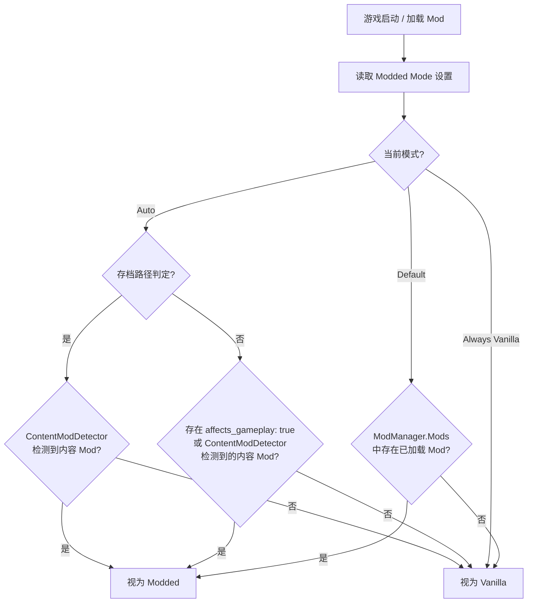
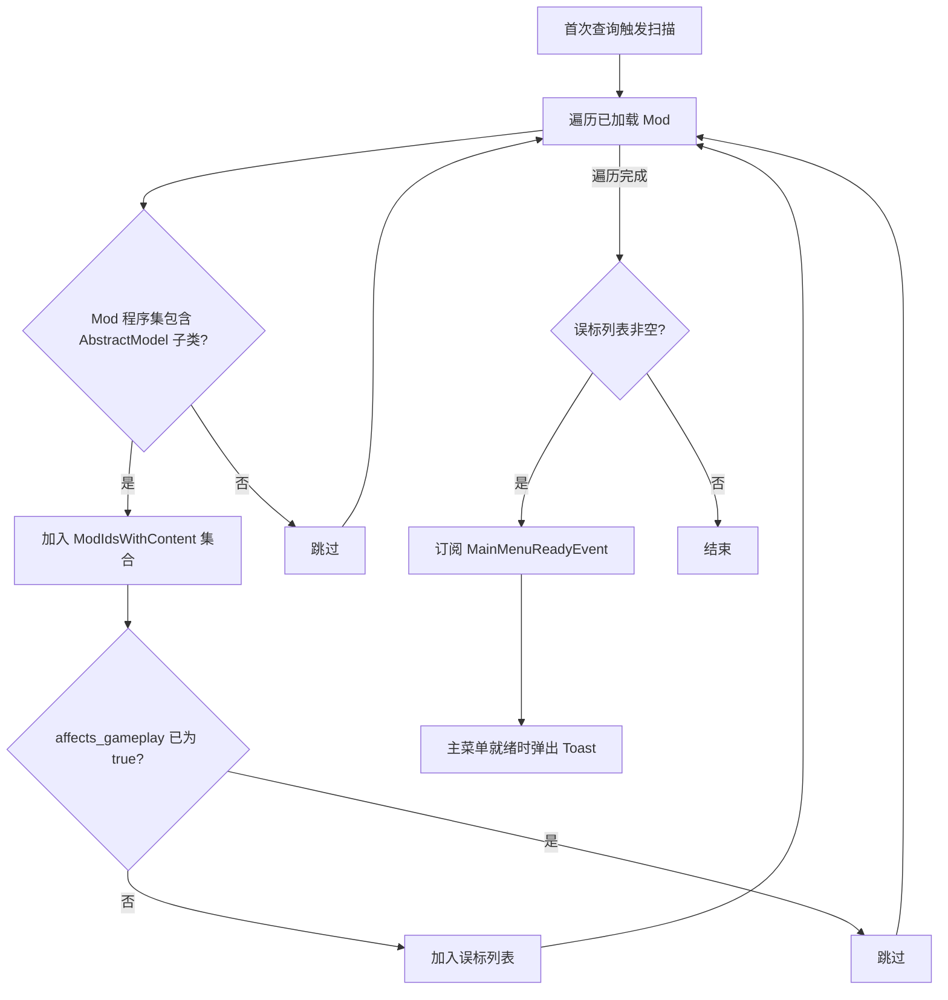

# Respect Affects Gameplay

[](LICENSE)
[](https://dotnet.microsoft.com/)
[](https://github.com/xiting910/RespectAffectsGameplay/actions/workflows/ci.yml)
[](https://github.com/xiting910/RespectAffectsGameplay/actions/workflows/codeql-analysis.yml)
[](https://github.com/xiting910/RespectAffectsGameplay/actions/workflows/dependency-review.yml)

**Respect Affects Gameplay** 是 Slay the Spire 2 的 Mod，通过程序集扫描智能管理游戏的 modded 状态。它阻止游戏盲目地将所有 Mod 都视为影响游戏性，而是分别判定：存档路径仅对真正的游戏内容 Mod（卡片、遗物、角色等）隔离；整体 modded 状态则综合 `affects_gameplay` 标记与内容检测结果。同时自动检测并警告标记不准确的 Mod。

---

## 目录

- [Respect Affects Gameplay](#respect-affects-gameplay)
  - [目录](#目录)
  - [安装](#安装)
    - [通过 Steam 创意工坊安装（推荐）](#通过-steam-创意工坊安装推荐)
    - [手动安装](#手动安装)
  - [项目结构](#项目结构)
  - [解决的问题](#解决的问题)
    - [存档路径被强行分离](#存档路径被强行分离)
    - [联机匹配被任意 Mod 阻塞（已在 STS2 v0.108.0 由官方修复）](#联机匹配被任意-mod-阻塞已在-sts2-v01080-由官方修复)
    - [首次存档复制的副作用（v0.108.0 新增）](#首次存档复制的副作用v01080-新增)
  - [工作原理](#工作原理)
    - [Harmony 补丁](#harmony-补丁)
    - [内容 Mod 检测与误标警告](#内容-mod-检测与误标警告)
  - [设置说明](#设置说明)
  - [构建](#构建)
    - [环境要求](#环境要求)
    - [构建步骤](#构建步骤)
  - [本地化](#本地化)
    - [翻译文件格式](#翻译文件格式)
    - [添加新语言翻译](#添加新语言翻译)
    - [翻译文件加载优先级](#翻译文件加载优先级)
  - [许可证](#许可证)
  - [致谢](#致谢)

---

## 安装

本 Mod 已上架 **Steam 创意工坊**，推荐通过工坊订阅安装，自动获取更新。

### 通过 Steam 创意工坊安装（推荐）

1. 在 Steam 中打开 Slay the Spire 2 的 **创意工坊**。

2. 搜索 **"Respect Affects Gameplay"** 即可找到本 Mod。

3. 点击绿色的 **「订阅」** 按钮。

4. 开始游戏即可生效。

### 手动安装

如果你需要手动安装最新开发版，请参考下方 [构建](#构建) 章节自行编译，然后将 `workshop/content/` 下的文件放入游戏的 Mods 目录。

---

## 项目结构

```
RespectAffectsGameplay/
├── .github/
│   ├── workflows/                                         # GitHub Actions 工作流
│   │   ├── ci.yml                                         #   → push/PR 自动编译验证
│   │   ├── release.yml                                    #   → 推送 v* 标签自动构建、发布 Release + Steam 创意工坊
│   │   ├── codeql-analysis.yml                            #   → CodeQL 代码安全分析（C#）
│   │   ├── dependency-submission.yml                      #   → 提交依赖快照供 Dependency Review 使用
│   │   ├── dependency-review.yml                          #   → PR 中依赖变更时扫描已知漏洞
│   │   └── dependabot-auto-merge.yml                      #   → Dependabot PR CI 通过后自动审批并 squash 合并
│   ├── ISSUE_TEMPLATE/                                    # Issue 模板
│   │   ├── config.yml                                     #   → 模板配置（启用空白 Issue、联系链接）
│   │   ├── bug_report.md                                  #   → Bug 报告模板
│   │   └── feature_request.md                             #   → 功能建议模板
│   ├── PULL_REQUEST_TEMPLATE.md                           # PR 模板
│   └── dependabot.yml                                     # Dependabot 自动依赖更新配置（NuGet + GitHub Actions）
├── stubs/                                                 # 桩项目（仅 CI 使用，本地开发不需要）
│   ├── sts2/
│   │   ├── sts2.csproj                                    # 模拟 STS2 游戏程序集
│   │   └── Stubs.cs                                       # 桩类型: ModManager, UserDataPathProvider 等
│   └── 0Harmony/
│       ├── 0Harmony.csproj                                # 模拟 HarmonyLib 程序集
│       └── Stubs.cs                                       # 桩类型: Harmony, HarmonyPatch 等
├── scripts/
│   ├── RespectAffectsGameplay.csproj                      # 主项目文件 (.NET 9.0)
│   ├── RespectAffectsGameplay.json                        # Mod 元数据清单
│   ├── RespectAffectsGameplayMod.cs                       # Mod 入口: 初始化 / 设置页面 / 补触发存档复制
│   ├── GameplayStateHelper.cs                             # 核心判定: IsEffectivelyModded + 缓存 + mode 评估
│   ├── ModdedMode.cs                                      # Modded 模式枚举 (Auto / AlwaysVanilla / Default)
│   ├── ModInfo.cs                                         # Mod 元数据信息 (ID / 名称 / 版本 / 作者 / HarmonyId)
│   ├── ModLoc.cs                                          # 本地化系统 (基于 RitsuLib I18N 框架，翻译文件作为嵌入资源分发)
│   ├── ModLog.cs                                          # 统一日志系统 (自动前缀 + 详细日志开关)
│   ├── ModSettingsData.cs                                 # 持久化设置数据模型
│   ├── ModSettingsHelper.cs                               # 设置初始化 / 持久化 / 重置为默认值
│   ├── ContentModDetector.cs                              # 内容 Mod 检测: 程序集扫描 + Toast 警告
│   ├── ModExtensions.cs                                   # Mod 扩展方法: IsLoaded() / GetId() / ContainsAbstractModel()
│   ├── PatchGetAccountDir.cs                              # 补丁: 存档路径决策 (Critical, IPatchMethod)
│   ├── PatchCopyUnmoddedSaveFilesIfNeeded.cs              # 补丁: 存档复制拦截 (Optional, IPatchMethod)
│   ├── PatchModManagerIsRunningModded.cs                  # 补丁: IsRunningModded 拦截 (Optional, IPatchMethod)
│   ├── localization/                                      # 本地化语言文件
│   │   ├── eng.json                                       #   英语
│   │   └── zhs.json                                       #   简体中文
│   └── Directory.Build.props                              # 开发环境路径配置 (gitignore, CI 不需要)
├── workshop/                                              # Steam 创意工坊上传工作区
│   ├── workshop.json                                      #   工坊元数据（标题、描述、可见性、标签）
│   ├── mod_id.txt                                         #   工坊物品 ID
│   └── image.png                                          #   工坊封面图
├── RespectAffectsGameplay.slnx                            # 解决方案文件
├── .editorconfig                                          # 代码风格配置
├── .gitignore                                             # Git 忽略规则
├── LICENSE                                                # MIT 许可证
├── CHANGELOG.md                                           # 变更日志
└── README.md                                              # 本文档
```

---

## 解决的问题

默认情况下，STS2 只要检测到**任意** Mod 被加载，就会将整个游戏标记为 "modded" 状态，而不区分 Mod 的类型和实际影响。这导致了以下问题：

### 存档路径被强行分离

`UserDataPathProvider.GetProfileDir()` 根据 `IsRunningModded` 属性决定存档目录是否带有 `modded/` 前缀。任何 Mod（包括外观、基础库、辅助类等 `affects_gameplay: false` 的 Mod）加载后，`IsRunningModded` 被设为 `true`，存档即被隔离到 `modded/profileX/`。卸载这些 Mod 后存档看似"丢失"，因为它还在 `modded/` 子目录中。

### 联机匹配被任意 Mod 阻塞（已在 STS2 v0.108.0 由官方修复）

早期版本中 `ModelIdSerializationCache.Init()` 在计算联机 XXH32 哈希时，不区分 Mod 的 `affects_gameplay` 标记，导致纯外观 Mod 也会阻塞联机匹配。
**此问题已在 STS2 v0.108.0 中由官方修复**：`Init()` 重写后使用 `ContentSorter<T>` 排序，并在哈希计算中加入 `affectsGameplay` 条件过滤，且 `JoinFlow` 在联机握手阶段通过 `GetGameplayRelevantModNameList()` / `GetNonGameplayRelevantModNameList()` 正确区分 gameplay 与非 gameplay Mod。

**RespectAffectsGameplay** 现在专注于解决存档路径问题：通过程序集扫描检测真正的游戏内容 Mod（卡片、遗物、角色等），实现存档/非存档双重判定标准，让存档路径隔离仅对内容 Mod 生效。

### 首次存档复制的副作用（v0.108.0 新增）

v0.108.0 引入了 `ModManager.CopyUnmoddedSaveFilesIfNeeded()` 方法：当玩家从「从未安装过 Mod」首次过渡到「安装了任意 Mod」时，游戏会**无条件**将原版存档全量复制到 `modded/` 子目录。问题在于它只看 `_settings.ModList` 是否为空（即「上次有没有 Mod」），而不检查这些 Mod 是否真正影响 gameplay。

这意味着：玩家第一次安装一个纯外观 Mod（`affects_gameplay: false`）时，存档也会被复制到 `modded/` 目录。由于本 Mod 让游戏继续在 vanilla 路径读写，被复制的文件将永远不被使用，成为死数据。

**RespectAffectsGameplay** 通过劫持 `CopyUnmoddedSaveFilesIfNeeded` 解决了这个副作用：只有在确实处于 gameplay modded 状态时才放行复制，纯外观 Mod 不会触发无用的存档迁移。

---

## 工作原理



`IsEffectivelyModded(bool isForSaveDir)` 采用双重判定标准：

- **存档路径** (`isForSaveDir: true`)：通过 `ContentModDetector.HasContentModsLoaded()` 判断——仅当 Mod 程序集中实际包含 `AbstractModel` 子类（卡片、遗物、角色等游戏内容数据）时才视为 modded，纯代码/UI 类 Mod 不再触发存档隔离。
- **非存档功能** (`isForSaveDir: false`)：通过 `EvaluateAutoMode()` 判断——检查 `affects_gameplay` 标记为 `true` 或被 `ContentModDetector` 检测到的内容 Mod。用于 UI 标签、Sentry 错误上报、遥测数据等场景的 modded 状态控制。

### Harmony 补丁

本 Mod 使用 RitsuLib 框架的 `ModPatcher` + `IPatchMethod` 体系管理 Harmony 补丁，替代手动管理 `Harmony` 实例和基于 `[HarmonyPatch]` 属性的程序集扫描。三个补丁类各自实现 `IPatchMethod` 接口声明目标信息，由 `ModPatcher` 统一注册、应用和诊断。

| 补丁                                 | 目标方法                                   | 重要性   | 作用                                                                                                 |
| ------------------------------------ | ------------------------------------------ | ------- | ---------------------------------------------------------------------------------------------------- |
| `PatchGetAccountDir`                 | `UserDataPathProvider.GetAccountDir`       | Critical | `forceModState` 为 null 时根据 `IsEffectivelyModded(true)` 返回 `"modded"` 或 `""`，否则透传原始逻辑 |
| `PatchCopyUnmoddedSaveFilesIfNeeded` | `ModManager.CopyUnmoddedSaveFilesIfNeeded` | Optional | 仅 gameplay modded 状态才执行首次存档复制，避免纯外观 Mod 产生无用存档副本                           |
| `PatchModManagerIsRunningModded`     | `ModManager.IsRunningModded`               | Optional | 用户可选的补丁，开启后连 UI、Sentry、联机列表也受 Modded Mode 控制                                   |

> **设计决策**:
> - **ModPatcher + IPatchMethod 体系**: 使用 `RitsuLibFramework.CreatePatcher()` 创建补丁器，
>   通过 `patcher.RegisterPatch<T>()` 显式注册（T 实现 `IPatchMethod`），再调用 `patcher.PatchAll()` 统一应用。
>   相比旧的 `new Harmony(…).PatchAll(assembly)` 全程序集扫描，显式注册避免了 `[HarmonyPatch]` 属性引用
>   无法加载类型时的崩溃风险，并提供 Critical/Optional 区分——Critical 补丁失败时自动回滚所有补丁。
> - **条件注册替代先应用再撤销**: `PatchModManagerIsRunningModded` 不再通过 `PatchAll` 后 `Unpatch` 实现可选，
>   而是在 `PatchAll()` 之前根据用户设置决定是否注册，消除补丁短暂存在的时间窗口。
> - **Linux 原生库预加载**: 删除自定义 `LinuxNativeHelper.cs`，RitsuLib 在框架初始化时已通过
>   `LinuxHarmonyNativePreloader` 自动处理（支持 `libgcc_s.so.1` + `libunwind.so.8/so`）。
> - **`IsEffectivelyModded(bool isForSaveDir)`** 采用双重判定标准：
>   - **存档路径** (`isForSaveDir: true`)：基于 `ContentModDetector` 程序集扫描结果，
>     仅当存在包含 `AbstractModel` 子类的内容 Mod 时视为 modded。
>   - **非存档功能** (`isForSaveDir: false`)：基于 `affects_gameplay` 标记 + 内容 Mod 检测结果，
>     用于 UI 标签、Sentry、遥测等非存档场景的 modded 状态判定。
> - `PatchCopyUnmoddedSaveFilesIfNeeded` 解决 v0.108.0 首次存档复制的副作用。
>   游戏在 `Initialize()` 末尾通过 `_settings.ModList.Count == 0` 判定「首次安装 Mod」，
>   不区分 gameplay 与 非 gameplay，导致纯外观 Mod 也会触发存档迁移。补丁在
>   `IsEffectivelyModded(true)` 为 false 时直接跳过整个方法。
>   但跳过复制后会留下一个缺口：`_settings.ModList` 已被填充，后续即使安装了 gameplay Mod，
>   游戏也不会再触发复制（`ModList` 已非空）。
>   为此，`Initialize()` 步骤 4 通过订阅 `MainMenuReadyEvent`，在主菜单就绪后检查
>   `IsEffectivelyModded(true)` 为 true 且 `ModManager.UnmoddedSavesWereCopied` 为 false 时
>   补调用一次 `CopyUnmoddedSaveFilesIfNeeded`，确保 gameplay Mod 首次出现时存档一定会被迁移。
> - `PatchModManagerIsRunningModded` 默认关闭。该方法被 UI（主界面 / 游戏内 mod 数量）、
>   Sentry 错误上报、联机 Mod 列表等多处调用，统一替换会隐藏 UI 信息。用户可在设置中手动开启。

### 内容 Mod 检测与误标警告

`ContentModDetector` 采用懒加载扫描机制：首次调用 `HasContentModsLoaded()` 或 `IsContentMod()` 时自动触发 `PerformScan()`，扫描所有已加载 Mod 的程序集，检测 `affects_gameplay` 标记是否准确：



**验证逻辑**: 通过 `ModExtensions.ContainsAbstractModel()` 扩展方法（内部调用 `ReflectionHelper.GetSubtypesFromAssembly()`）扫描每个已加载 Mod 的所有程序集，若发现任何 `AbstractModel` 子类型，则将该 Mod 记录为内容 Mod。如果该 Mod 的 `affects_gameplay` 标记为 `false`，则判定为误标。

**`HasContentModsLoaded()`**: 提供轻量级查询接口，用于存档路径判定（`IsEffectivelyModded(true)`）——仅当存在包含 `AbstractModel` 子类的内容 Mod 时才隔离存档。

**Toast 提醒**: 主菜单就绪后通过 `RitsuToastService` 弹出 5 秒 `Warning` 级别通知，列出所有标记不准确的 Mod ID，提醒玩家联系 Mod 作者修复并建议暂时禁用。

**Auto 模式自动修正**: 验证结果不止用于报警。`EvaluateAutoMode()` 在分类 Mod 时会通过 `ContentModDetector.IsContentMod()` 将检测到的内容 Mod **强制视为 gameplay Mod**，等同于修正了 `affects_gameplay` 标记。这意味着即使 Mod 作者未正确设置元数据，本 Mod 也能在运行时主动保护存档路径不受误标 Mod 影响而导致出错。

> ⚠ 若 RitsuLib 版本不支持 Toast API，会静默跳过，不影响 Mod 核心功能及 Auto 模式修正逻辑。

---

## 设置说明

在游戏内的 Mod 设置页面中，你可以更改本 Mod 的行为。以下是各设置项的说明：

| 设置项                     | 选项                         | 行为                                                                                                                                                  |
| -------------------------- | ---------------------------- | ----------------------------------------------------------------------------------------------------------------------------------------------------- |
| **Modded Mode**            | `Auto`（自动）⭐              | 双重标准：存档路径隔离仅对程序集扫描检测到的内容 Mod（卡片/遗物/角色等）生效；非存档功能（UI/Sentry/遥测）对 `affects_gameplay: true` 或内容 Mod 生效 |
|                            | `Always Vanilla`（强制原版） | 永不视为 modded（⚠ 可能导致存档损坏）                                                                                                                 |
|                            | `Default`（游戏默认）        | 使用游戏原版逻辑（ModManager.Mods），加载任意 Mod 即视为 modded                                                                                       |
| **拦截 IsRunningModded()** | 关闭（默认）                 | 仅存档路径受控，UI / 联机列表不受影响                                                                                                                 |
|                            | 开启                         | `ModManager.IsRunningModded()` 也受 Modded Mode 控制                                                                                                  |
| **详细日志**               | 关闭（默认）                 | 仅输出标准 Info / Warn / Error 日志                                                                                                                  |
|                            | 开启                         | 额外输出详细日志 (仅影响本 mod, 即时生效)                                                                                                          |
| **重置为默认设置**         | 点击「恢复默认」按钮         | 所有设置恢复默认值（Modded Mode → 自动，其余开关 → 关闭）                                                                                             |

> ⚠ 除「详细日志」外, 其余设置项修改后需**重启游戏**才能生效。

---

## 构建

### 环境要求

- [.NET 9.0 SDK](https://dotnet.microsoft.com/download/dotnet/9.0)
- STS2 游戏本体（用于引用程序集）
- 项目自动检测目标平台（Windows / macOS / Linux / Android），无需手动配置平台参数

### 构建步骤

1. 克隆仓库：
   ```bash
   git clone https://github.com/xiting910/RespectAffectsGameplay.git
   ```

2. 在 `scripts/` 目录下创建 `Directory.Build.props`（**本地开发必需**，CI 不需要）：
   ```xml
   <Project>
     <PropertyGroup>
       <Sts2Dir>你的 STS2 游戏安装路径</Sts2Dir>
     </PropertyGroup>
   </Project>
   ```
   > 该文件已在 `.gitignore` 中排除，不会提交到仓库。若未创建此文件，项目将回退使用 `stubs/` 下的桩程序集编译。

3. 构建项目：
   ```bash
   dotnet build
   ```

   构建完成后，产物会自动复制到：**`workshop/content/`** — 供 Steam 创意工坊上传

> **CI 说明：** `ci.yml` 在每次 push/PR 时自动编译验证。`release.yml` 在推送 `v*` 标签时自动发布 GitHub Release 并更新 Steam 创意工坊。

> ⚠ **重要：`stubs/` 必须与项目引用和游戏实际 API 保持同步！**
>
> CI 环境没有 STS2 游戏本体，完全依赖 `stubs/` 目录下的桩程序集进行编译。
> 如果你在代码中使用了新的游戏 API（新的类、方法、属性等），**必须同步更新 `stubs/` 中对应的桩代码**，
> 否则 CI 编译会失败，PR 无法合并。
>
> - `stubs/sts2/Stubs.cs` — 模拟 STS2 游戏程序集中的类型（`ModManager`、`UserDataPathProvider`、`AbstractModel` 等）
> - `stubs/0Harmony/Stubs.cs` — 模拟 HarmonyLib 中的类型（`Harmony`、`HarmonyPatch`、`HarmonyPrefix` 等）
>
> 桩方法体可以留空（`throw new NotImplementedException()`），但**方法签名必须与实际游戏库一致**。

---

## 本地化

本 Mod 的界面文本通过 [STS2-RitsuLib](https://github.com/BAKAOLC/STS2-RitsuLib) 的 I18N 框架实现多语言支持。翻译文件以 JSON 格式存放于 `scripts/localization/` 目录，作为嵌入资源（`EmbeddedResource`）编译到程序集中。

### 翻译文件格式

```json
{
    "settings.section.general": "通用",
    "settings.mode.label": "Modded 模式",
    "settings.mode.option.auto": "自动",
    ...
}
```

键名与代码中的 `ModSettingsText.I18N` 调用一一对应。

### 添加新语言翻译

**方式一：从源码构建（开发者推荐）**

1. 在 `scripts/localization/` 下创建新的 JSON 文件，命名为 `{语言代码}.json`（例如 `jpn.json`、`kor.json`）
   > 语言代码参考 STS2 规范：`eng`（英语）、`zhs`（简体中文）、`zht`（繁体中文）、`jpn`（日语）、`kor`（韩语）等
2. 复制 `eng.json` 的全部键，将值翻译为目标语言
3. 构建项目，新文件会被 `.csproj` 的通配符 `<EmbeddedResource Include="localization\*.*" />` 自动收录为嵌入资源

**方式二：运行时添加（最终用户方式）**

1. 找到本 Mod 的用户数据目录：`Godot.OS.GetUserDataDir()/RespectAffectsGameplay/localization/`
   - Windows 位于 `%AppData%/Roaming/SlayTheSpire2/RespectAffectsGameplay/localization/`
2. 将 `{语言代码}.json` 文件放入该目录
3. 重启游戏即可生效

### 翻译文件加载优先级

```
用户数据目录下的文件（最高优先级）
         ↓
内置嵌入资源（回退，随 Mod 分发）
```

> 首次运行时，`ModLoc.Initialize()` 会自动将内置的翻译文件从嵌入资源导出到用户数据目录。
> 用户可在此目录中直接修改或替换翻译，无需重新编译 Mod。

---

## 许可证

本项目基于 [MIT License](LICENSE) 开源。

---

## 致谢

- 本项目灵感来源于 [luojiesi/SLS2Mods](https://github.com/luojiesi/SLS2Mods/tree/master/UnifiedSavePath) 中的 UnifiedSavePath Mod，它使用 Harmony 补丁拦截 `IsRunningModded` 来统一存档路径。本项目在此基础上扩展了程序集级内容 Mod 检测、存档/非存档双重判定标准、存档迁移控制、误标 Mod 警告、多模式切换、游戏内设置页面等功能。
- [BAKAOLC/STS2-RitsuLib](https://github.com/BAKAOLC/STS2-RitsuLib) — STS2 Mod 核心框架
- [Harmony](https://github.com/pardeike/Harmony) — .NET 运行时方法补丁库
- [Slay the Spire 2](https://store.steampowered.com/app/2868840/Slay_the_Spire_II/) — Mega Crit Games
